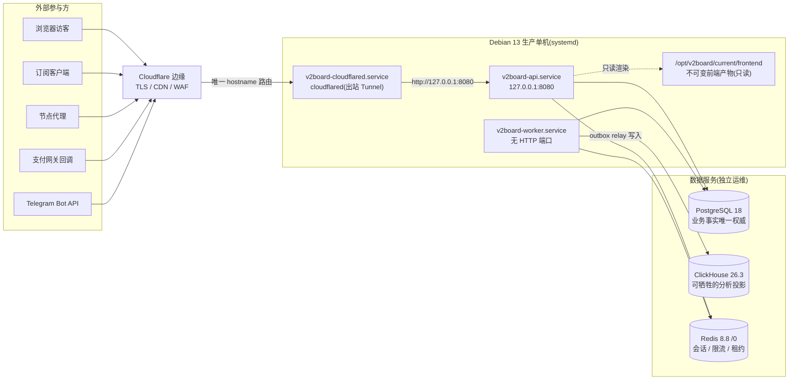
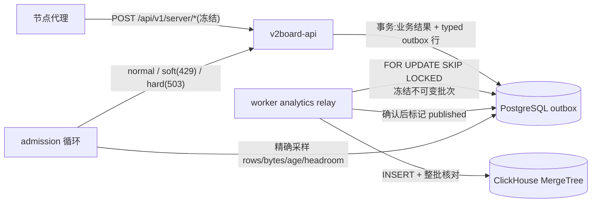

# 架构总览

本文是 V2Board Native 的入门地图:一台 Debian 13 生产单机上的 Rust API + Rust
worker + 源码构建前端,数据落在 PostgreSQL / ClickHouse / Redis 三个各司其职的
存储里。这里只讲"系统长什么样、请求怎么走、数据归谁管";每个领域的硬性契约
在文末链接的专项文档里,历史决策见 [`docs/adr/`](adr/README.md)。

## 系统上下文

生产拓扑固定为单机 systemd:唯一公网入口是同机运行的 remotely-managed named
Cloudflare Tunnel(出站连接,主机不监听 80/443/8080),Rust API 只绑定
`127.0.0.1:8080`,worker 没有 HTTP 端口。前端是构建期验证过的不可变静态产物,
由 Rust 直接渲染和分发,不存在 Nginx 或第二个反向代理。



要点:

- API 当前**不查询 ClickHouse**;只有 worker 的 analytics relay 以最小权限
  writer 写入。ClickHouse 短暂故障不影响认证、订单、支付。
- API 与 worker 使用不同的无登录 Unix 用户、不同的 PostgreSQL principal 和
  不同的 Redis ACL 用户(worker 无权访问认证状态)。
- `/healthz`、`/readyz`、`/metrics` 只应答直连 loopback、Host 精确为
  `127.0.0.1:8080` 且不带 `CF-Connecting-IP` 的探测,公网 hostname 永远拿不到
  它们。

## HTTP 请求路径

```mermaid
sequenceDiagram
    participant C as 客户端
    participant CF as Cloudflare 边缘
    participant T as cloudflared(同机)
    participant IN as ingress 信任层
    participant MW as 中间件栈
    participant RT as 路由族

    C->>CF: HTTPS 请求(Cloudflare 拥有公网 TLS)
    CF->>T: Tunnel 转发(附加 CF-Connecting-IP)
    T->>IN: http://127.0.0.1:8080
    Note over IN: 仅当对端命中 trusted_proxy_cidrs<br/>(生产固定 127.0.0.1/32)才信任单值<br/>CF-Connecting-IP;Forwarded / X-Forwarded-*<br/>一律不信任
    IN->>MW: request-id 生成与传播 → trace 日志<br/>→ 请求体大小 / 超时限制 → CORS → 压缩<br/>→ Accept-Language 协商 → 安全响应头<br/>→ 按已解析 ClientIp 限流
    MW->>RT: 分发到路由族
    Note over RT: /api/v1/auth(登录 / 注册 / step-up)<br/>/api/v1/user(内部现代方言)<br/>/api/v1/{admin_path}(动态后台前缀)<br/>/api/v1/public、/api/v1/guest(冻结)<br/>/api/v1/client、/api/v1/server、/api/v2/server(冻结)<br/>/assets/* 与 SPA HTML fallback
    RT-->>C: 成功:bare JSON / {items,total} / 302 / 204<br/>内部错误:RFC 9457 problem+json(稳定 code)<br/>冻结外部命名空间:保持旧 {data}/{message} 字节
```

补充说明:

- 认证在各路由族入口执行:`Authorization: Bearer` 不透明 token 经 SHA-256
  在 Redis 查找会话;admin 路由挂在运行时可变的 `secure_path` 动态前缀下
  (`crates/api/src/fallback.rs` 的方法感知 dispatch 保证 PATCH/PUT/DELETE 在
  前缀热更后仍可达)。
- HTML 交付也归 API:`/{admin_path}/*` 返回 admin `index.html`,其余 GET/HEAD
  路径回落到 user `index.html`(history routing),渲染时把
  `__V2BOARD_RUNTIME_CONFIG__` token 替换为品牌、语言、动态后台路径等运行时
  配置(`crates/api/src/frontend.rs`)。
- 内部与外部错误模型的完整定义(code registry、状态映射、401/403 语义)见
  [`api-dialect.md`](api-dialect.md) §3;外部字节冻结清单见其 §2。

## 后端 crate 结构

`backend/rust/crates/` 下共 22 个 workspace crate。核心只向内依赖，外围 crate
实现 application 定义的端口；HTTP 与 worker 是两个组合根：

| Crate | 职责 |
| --- | --- |
| `api` | Axum HTTP API、前端 HTML/静态资源交付、认证入口、限流、metrics、golden wire 契约测试;产出 `v2board-api` |
| `api-contract` | 与 application/存储无关的内部 HTTP DTO、158 个唯一 operation 的注册源与 OpenAPI 3.1 投影；64 个 JSON request body 与 95 个 JSON success representation 全部是具名字段级契约，同一 method/path 注册同时驱动 Axum 与 TypeScript/Zod 生成 |
| `application` | 纯 use case 编排、command/view、业务错误与 outbound ports；普通依赖严格只有 `thiserror` 和 `domain-model`，不含 serde、SQL、Redis、HTTP、SMTP、异步 runtime 或运行时配置 |
| `domain-model` | 零依赖的业务值对象与策略；包含金额、套餐价格、订单词汇、续费、订阅/流量重置、佣金、内容、优惠券、礼品卡、节点及工单政策 |
| `problem-code` | 零依赖的 101 个应用级 problem code/status/title 注册源；runtime 使用默认或本地化 detail，OpenAPI 投影完整 tuple |
| `workers` | 调度器、持久后台任务(流量结算、订单、佣金、提醒邮件、重置、统计)、mail outbox 排空与 analytics relay;产出 `v2board-workers` |
| `analytics` | 类型化不可变分析事件、PostgreSQL outbox、容量准入(admission)、ClickHouse 投影与批次校验;产出 `v2board-analytics-schema` |
| `db` | PostgreSQL-only repository adapters、事务性/CAS 操作与连接池；实现 application 的持久化端口，SQL 不进入 handler/use case |
| `auth-adapters` | 认证外层适配：密码学、Redis 会话/限流、验证 HTTP、邮件和运行时组合 |
| `configuration-adapters` | operator config 权威/激活、SMTP/Telegram 管理动作与 bulk-mail 适配 |
| `http-adapters` | 对不可信上游 HTTP response 做统一大小上限与有界 JSON/bytes 读取 |
| `mail-adapters` | 邮件模板、SMTP、事务性 durable outbox，以及提醒候选/enqueue 与 relay claim/ack/failure/cleanup 的 PostgreSQL 适配 |
| `order-adapters` | 订单 use case 的运行时组合、配置策略、时钟和稳定编号/identity 适配 |
| `payment-adapters` | 支付 provider catalog、加密配置/密钥与支付网关 HTTP 适配 |
| `redis-adapters` | 共享 Redis admission、运行态验证与边界适配 |
| `server-adapters` | 节点 credential 与 server runtime 外层适配 |
| `subscription-adapters` | 按订阅方式解析/生成链接 token 与 Redis minting 适配 |
| `config` | native `file_only`/`boot_only` JSON 配置的加载、typed 校验与 Redis keyspace 约定 |
| `compat` | 共享 wire 模型:RFC 9457 problem+json、冻结外部命名空间的 legacy 响应封装、分页、安全响应头 |
| `contract` | 门禁二进制:route audit、live SQL prepare 清单、golden responses、production invariants、worker reconcile |
| `provision` | `mysql-import.v1` manifest 解析、固定转换 policy 与 converter、release archive 审计 |
| `lifecycle` | 一次性 MySQL 导入 CLI(`validate`/`inspect`/`execute`),不进入长期 native release |

依赖边界由 resolved Cargo graph、源码方向门禁及 `make native-database-audit`
共同看守：`domain-model` 的 normal/build/dev 依赖均为空，`application` 的精确
普通依赖集合只有 `thiserror` + `domain-model`，且不得导入 transport 或
infrastructure；`api-contract` 与 application 互不依赖，转换只发生在 API inbound
adapter。MySQL driver 只允许出现在 lifecycle/provision 导入图里，API/worker/
analytics 运行时依赖图不得回流。完整方向见
[`../backend/rust/ARCHITECTURE.md`](../backend/rust/ARCHITECTURE.md)。

## Worker 与数据流

`v2board-workers` 是单个二进制里的一组独立 Tokio/cron 循环
(`crates/workers/src/scheduler.rs`):traffic_update、statistics、check_order、
check_commission、check_ticket、check_renewal、reset_traffic、reset_log、
send_remind_mail。

- **调度器单例**:每个计划任务先取 Redis 分布式租约
  (`crates/workers/src/lease.rs`),运行期间周期续租;续租失败或租约丢失会
  取消在途任务,保证同一任务不会双实例并发。
- **流量上报 → ClickHouse**:API 持久接受 `traffic.reported.v1`;结算 worker 在
  **同一个 PostgreSQL 事务**里锁定 epoch、更新权威额度、完成幂等状态并插入
  `traffic.accounted.v1` outbox 行 —— 永不同步双写 ClickHouse。



- **容量准入**:独立 admission 循环精确采样 outbox 压力;`soft_pressure` 对新增
  分析事件限速(超额 429),`hard_stop` 只让产生分析事件的流量事务预提交
  503 —— 认证、订单、支付不过这道门;relay 始终继续排空,达到 recovery 水位后
  自动恢复。状态同步进 Redis hash `RUST_ANALYTICS_ADMISSION` 并由 `/readyz`
  暴露。
- **Mail outbox**:请求处理器与后台任务都经
  `crates/mail-adapters/src/mail/outbox.rs` 事务性入队；纯编排与 retry/ack/retention
  policy 位于 `crates/application/src/worker_mail.rs`，PostgreSQL
  claim/ack/failure/cleanup 与 SMTP 位于 `crates/mail-adapters/src/worker.rs`。
  `crates/workers/src/outbox.rs` 只保留调度、配置快照、取消和 metrics，以每批 10
  封、15 分钟租约、最多 8 次尝试的节奏驱动 use case。
- **定时清理**:有界清理只删过期的已发布 analytics 证据(固定保留 7 天,每次
  ≤10,000 行、间隔 ≥5 分钟)、过期邮件记录与幂等状态(默认各保留 90 天);
  pending、quarantined 和持有租约的工作永不被清理。
- **健康**:worker 与 API 都用 systemd `Type=notify` + `WatchdogSec=30s`
  (API 的看门狗证明事件循环存活,依赖故障走 `/readyz` 而不是重启);worker 只有
  PostgreSQL 精确 migration ledger 与 Redis 探测通过才 `READY=1`,每个循环记录
  心跳,意外退出会终止整个进程交给 systemd 重启。worker 指标写入 Redis,由 API
  的 `/metrics` 统一转出(`v2board_worker_*`)。

## 数据所有权

| 存储 | 保存什么 | 丢了会怎样 |
| --- | --- | --- |
| **PostgreSQL 18**(唯一权威) | 用户、订阅、套餐、额度与 `u/d`、订单、支付、余额、佣金、优惠券、礼品卡、reconciliation、工单、幂等状态、`session_epoch`、节点凭据、operator config revision、analytics outbox、migration ledger、installation identity、`audit_log` | 灾难。必须 WAL 归档 + 每夜 base backup(PITR 到分钟级),无损失容忍;见 [`operations.md`](operations.md) §2 |
| **ClickHouse 26.3 LTS**(可牺牲) | `traffic.reported.v1` / `traffic.accounted.v1` 原始事件与按批次日聚合投影 | 接受全丢:空库重建 schema/bindings,只继续未发布及新事件;不承诺重放已发布历史,产品权威数字始终读 PostgreSQL |
| **Redis 8.8 `/0`**(运行态) | 会话查找键(SHA-256)、限流计数、调度租约与锁、worker 心跳与指标、admission 状态、短期缓存 | 接受全丢:全员重新登录,租约/心跳/限流自行重建;依赖会话的功能按 fail-closed 契约降级,绝不保存不可恢复账本 |

## 前端

两个独立 SPA(`frontend/apps/user`、`frontend/apps/admin`),React 19 +
TypeScript + Vite + Tailwind v4 + shadcn/Radix;共享代码在
`frontend/packages/{api-client,config,i18n,types,ui}`。所有 HTTP 请求经
`@v2board/api-client`,server state 归 TanStack Query,路由归 React Router
(history routing)。

全部 158 个唯一内部 HTTP operation（155 条迁移语义记录折叠后的 149 个
operation，加 9 个原生安全/审计 operation）由 Rust `api-contract` 注册表生成
提交到仓库的 OpenAPI、TypeScript 与 Zod。注册表钉住 method/path、path/query 参数、
公共及 operation-specific headers、请求体存在性、鉴权、精确成功状态/媒体组合及
RFC 9457 problem model；生成器拒绝 `2XX`/`3XX` 通配，并保留一个 operation
合法拥有多个明确成功状态或媒体类型的能力。64 个 JSON request body 与 95 个
JSON success representation 均以具名、字段级 DTO 为根，不存在递归 `JsonValue`
schema。结构对象默认明确关闭未知字段；开放结构只允许进入逐项登记且值类型受限的
动态 map（如 provider manifest 字段、队列名、transport headers、DNS host key）
以及 RFC 9457 extension member。

API client 在 Zod 解析响应体前校验采用单一成功状态的生成 endpoint；多状态
endpoint 使用生成的 `successResponses` 判别表。API adapter 显式转换 transport
DTO 与 application command/view，前端再显式转换 wire DTO、领域展示模型和 form
draft。`make api-contract-check` 逐字重建这些产物并阻止漂移；endpoint wrapper 只能
消费具名生成 operation，不能以手写 `unknown`/`any` schema 重新打开业务 DTO。

构建与发布链路:

1. `pnpm build:deploy`(Docker 内)对两个应用同时 typecheck、构建、校验 Vite
   manifest,产出扁平内容哈希文件;
2. 按两个应用**全部已验证文件的规范路径与真实字节**计算 `content-id`,发布为
   不可变 `releases/<content-id>/{user,admin}`;
3. `current`/`previous` 原子软链切换,只保留两代 —— 失败构建不会破坏最后一个
   可用 release,滚动发布间的在途静态请求可从 `previous` 完成;
4. 生产将验证过的树安装在 `/opt/v2board/current/frontend`(root 只读),Rust 经
   `V2BOARD_FRONTEND_DIR` 直接读取:请求时渲染 `index.html` 并注入
   `__V2BOARD_RUNTIME_CONFIG__` 运行时配置(品牌、语言、动态后台路径、
   `legacy_hash_redirect_enable` 等),哈希资源从
   `/assets/{user,admin}/*` 分发。

行为契约分两层(Tier-1 外部契约不可动 / Tier-2 表现层可放宽),像素级对比已
退役。`make interaction-parity` 是 source-world 常设门禁,
`make legacy-oracle-parity` 只用于有限兼容审计。`make real-stack-e2e` 先通过
不启动默认 runtime/data 服务或挂载普通业务数据卷的
`make deploy-artifact-smoke` 获得已验证发布树，再以 tmpfs 隔离 PostgreSQL/Redis，
验证真实登录与页面加载、配置事务，以及套餐价格 Retain/Clear/Set 穿过生成契约
和规范化 `plan_price` 的跨层闭环。该门禁复用 frontend/Rust 构建缓存、依赖、
deploy 与报告卷；容器间传递测试凭据的专用 runtime 卷在旅程前后清空；详见
[ADR 0006](adr/0006-frontend-contract-tiers-interaction-parity.md) 与根目录
`AGENTS.md` 的 Frontend Contract Direction。

## 更深的文档

- [`api-dialect.md`](api-dialect.md) — 内部 API 方言唯一权威:路由表、RFC 9457
  错误模型与 code registry、冻结外部命名空间、迁移波次记录。
- [`operations.md`](operations.md) — 生产运维手册:监控告警、备份/PITR、恢复
  演练、回滚、事故速查、审计追踪。
- [`postgresql-clickhouse-invariants.md`](postgresql-clickhouse-invariants.md)
  — 持久化不变量:数据所有权、outbox/admission、schema 方向、权限拓扑。
- [`mysql-import-invariants.md`](mysql-import-invariants.md) 与
  [`mysql-import.md`](mysql-import.md) — 一次性 MySQL 导入的固定契约与操作
  指南。
- [`release-process.md`](release-process.md) — 单一版本号策略、升版步骤与发布
  产物验证;变更记录见根目录 [`CHANGELOG.md`](../CHANGELOG.md)。
- [`../deploy/README.md`](../deploy/README.md) — 裸机安装、Cloudflare Tunnel
  接入与激活顺序;[`../backend/README.md`](../backend/README.md)、
  [`../frontend/README.md`](../frontend/README.md) — 两侧工作区细节。
- [`adr/`](adr/README.md) — 架构决策记录(含七篇回填的既成决策)。
